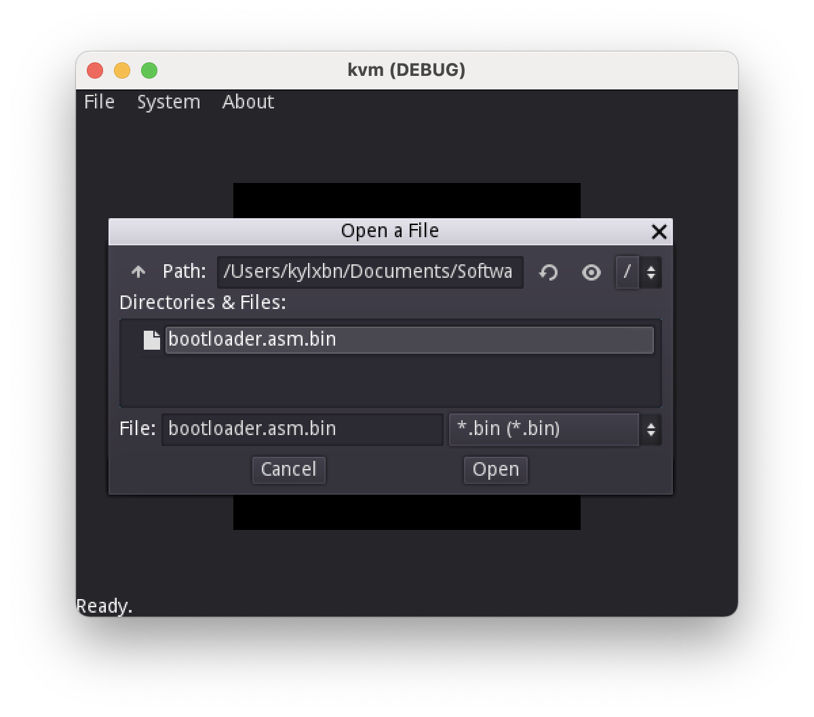
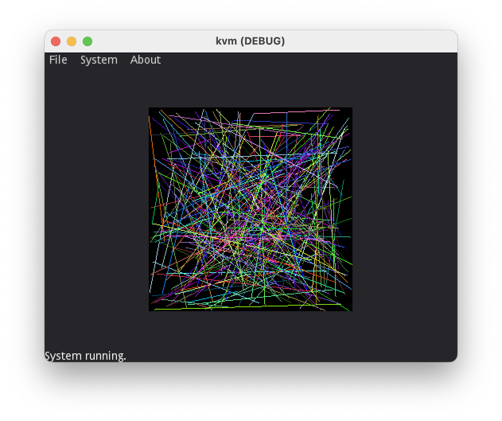
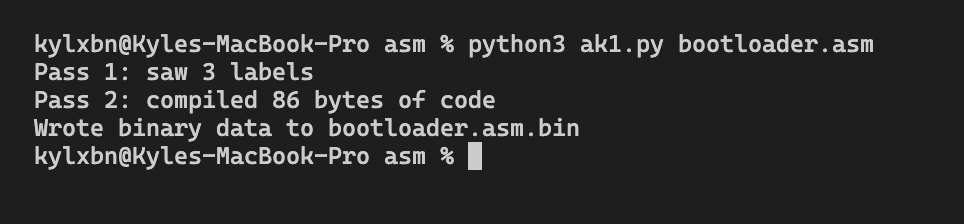

# K Virtual Machine

## Screenshots

#### KVM loading a Binary file to RAM

#### The bootloader displaying lines on screen

#### AK1 assembler compiling the bootloader

## What is this?

This is my attempt at creating my own virtual machine with custom
replaceable components (CPU, RAM, graphics) with the goal of creating
my own operating system that runs on this virtual machine.

## What is working?

Currently, this is extremely incomplete and more like a proof of concept
that "it might work". The RAM, video card, and CPU are currently
being "virtualized", in that:

1. The graphics card (named X1) is initialized (which contains a 256x256 framebuffer and 16 bytes of RAM)
2. The RAM is created (which contains 4,096 bytes worth of memory)
3. A device that provides random numbers (RandGen) is initialized
4. A memory mapper is created and the following are mapped to address space:
    1. RAM is mapped at `0x0000-0x0FFF`
    2. The GPU is mapped at `0xF0F0-0xF0FF`.
    3. The RandGen device is mapped at `0xF0E9`
    4. The HDD is mapped at `0xF100-0xF302`.
5. The bootloader is loaded automatically to RAM space `0x0000-0x00FF`.
    1. The default bootloader included in the repository (compiled from assembly) just access HDD sector 0, load that to `0x0300-0x03FF` while showing a loading progress bar, and then jumps execution to `0x0300`.
6. The default disk image in this repository was compiled from assembly and does nothing more than draw multicolored lines into the screen:
    1. The CPU transfers random coordinates into the GPU's address space `0xF0F0-0xF0F3`.
    3. The CPU gets random numbers to choose a random color and saves it at GPU address `0xF0F4-0xF0F6`.
    5. The CPU triggers a GPU line draw by writing something into `0xF0FF`.

### CPU (K1)

The CPU is a barely-working RISC variant with A and X registers. It is a tiny bit similar to the MOS 6502 CPU. It can

* load data into A or X either from an immediate value or from address space (absolute or relative from register X)
* subtract or add X or an immediate value from A (the result is left in A)
* zero flags for when subtraction or loading results in a 0 A value
* conditional jump (if zero flag is set) and jumps

### RAM

It has 4,096 bytes. That's it.

### GPU (X1)

Has a 256x256 pixel RGBA8 buffer, has 16-byte RAM where the CPU can send data to, and can draw lines in any color.

## What do you plan to do next?

Well, currently, this is extremely incomplete, too incomplete to
the point that I do not know what will happen yet. However, these are
things that I plan to do soon:

* DONE! ~~Virtualizing a hard drive~~
* Implementing the BIOS
* DONE! ~~Writing a bootloader~~
* Deciding on the CPU opcode list
* Finishing the CPU emulator
* DONE! ~~Writing a graphics device that can draw pixels and lines at least~~
* DONE! ~~Writing a basic proof of concept program (simple looping animation?)~~
* Writing basic keyboard device
* Writing an operating system (the hardest task, I guess)

## License

GPL-3, I guess. Not like anyone would care about this useless project.
